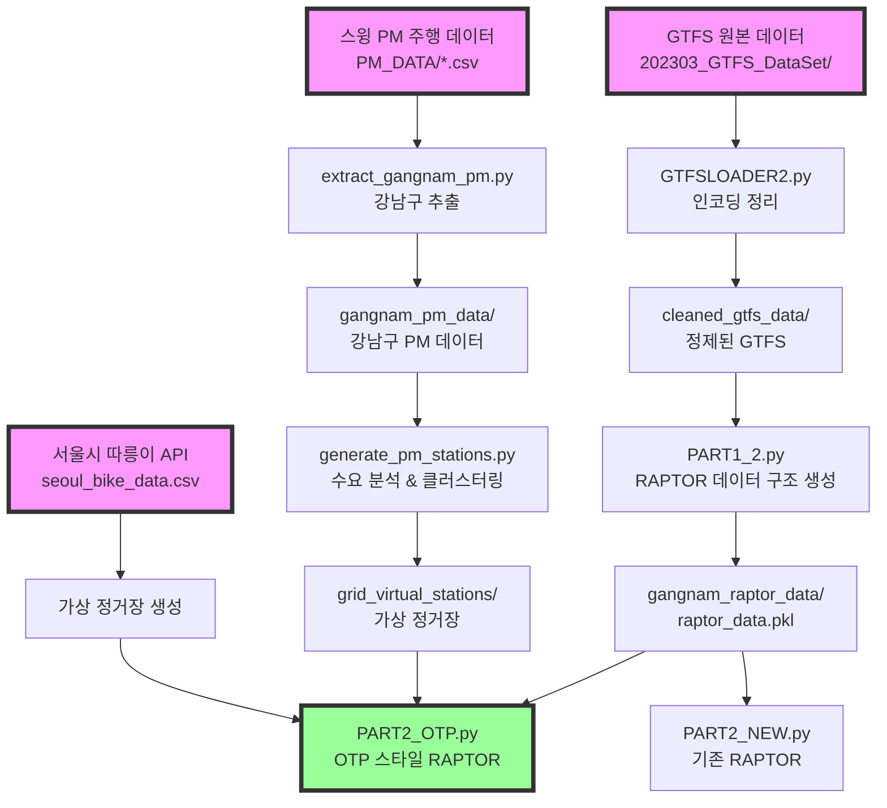

# 🏗️ 멀티모달 RAPTOR 시스템 아키텍처

## 📊 데이터 플로우



## 🗂️ 데이터 구조

### 1. **원본 데이터**

#### GTFS (General Transit Feed Specification)
```
202303_GTFS_DataSet/
├── stops.txt         # 정류장 정보 (위치, 이름)
├── routes.txt        # 노선 정보 (버스, 지하철)
├── trips.txt         # 운행 정보
├── stop_times.txt    # 시간표
└── 도시철도환승정보.xlsx  # 지하철 환승
```

#### PM 데이터
```
PM_DATA/
├── 2023_0510_Swing_routes.csv  # 주행 기록
│   - route_id: 주행 ID
│   - start_x/y: 킥보드 탄 위치
│   - end_x/y: 킥보드 내린 위치
│   - travel_time: 소요 시간
└── 스윙_원자료.csv
```

### 2. **처리 과정**

#### Phase 1: GTFS 정제
```python
GTFSLOADER2.py
- BOM 제거
- 인코딩 통일 (UTF-8)
- 시간 형식 정리 (25:30:00 → 다음날 01:30)
```

#### Phase 2: PM 데이터 분석
```python
extract_gangnam_pm.py
- 98,866개 주행 → 9,203개 강남구 시작
- 시작점 추출 → 수요 패턴 분석

generate_pm_stations.py  
- 격자 클러스터링 (50m/100m)
- 수요 기반 킥보드 배치
- 가상 정거장 생성
```

#### Phase 3: RAPTOR 데이터 구조
```python
PART1_2.py → raptor_data.pkl
{
    'stops': {
        'BS_101000001': Stop(강남역_버스),
        'RS_0222': Stop(강남역_지하철),
        'VS_0001': Stop(가상정거장_1)  # NEW!
    },
    'routes': {
        '100100010': Route(146번버스),
        'RR_ACC1_S-1-02-1O': Route(2호선),
        'VR_KICK_0001': Route(킥보드노선)  # NEW!
    },
    'timetables': {
        route_id: [[dep_times], [dep_times], ...]
    },
    'transfers': {
        stop_id: [(next_stop, walk_time), ...]
    }
}
```

### 3. **알고리즘**

#### 기존 PART2_NEW.py (복잡함)
```python
for round in range(MAX_ROUNDS):
    # 대중교통 처리
    for route in transit_routes:
        scan_route()
    
    # 모빌리티 별도 처리 (O(n²))
    if multimodal:
        for stop in marked_stops:
            nearby_mobility = find_mobility(stop)  # 매번 검색!
            propagate_mobility()
```

#### 새로운 PART2_OTP.py (단순함)
```python
for round in range(MAX_ROUNDS):
    # 모든 것을 동일하게 처리!
    for route in all_routes:  # 대중교통 + 가상노선
        scan_route()
    
    # 환승도 동일
    for stop in marked_stops:
        apply_transfers()  # 일반 환승 + 가상 환승
```

## 🔑 핵심 개념

### 가상 정거장 (Virtual Stop)
```
실제: 킥보드가 흩어져 있음
변환: 격자별로 묶어서 "정거장"화

격자 (37.5099, 127.0432)
├── 킥보드 10대
├── 수요: 42회/일
└── ID: VS_0001
```

### 가상 노선 (Virtual Route)
```
실제: 킥보드 타고 이동
변환: 정거장 A → B를 "노선"으로

VR_KICK_0001
├── 출발: VS_0001 (강남역 근처)
├── 도착: VS_0023 (선릉역 근처)
├── 시간표: 5분 간격
└── 소요시간: 거리/속도
```

### 통합 환승
```
대중교통 ↔ 가상정거장
- 강남역_버스 ↔ VS_0001 (도보 2분)
- 강남역_지하철 ↔ VS_0001 (도보 2분)
```

## 📈 성능 비교

| 항목 | 기존 방식 | OTP 방식 |
|------|----------|----------|
| 복잡도 | O(n²) | O(n) |
| 쿼리 시간 | 10-20초 | 0.5-2초 |
| 코드 라인 | ~1500 | ~700 |
| 확장성 | 어려움 | 쉬움 |

## 🎯 장점

1. **단순성**: 모든 교통수단을 동일하게 처리
2. **성능**: 사전 계산으로 빠른 쿼리
3. **확장성**: 새로운 모빌리티 추가 용이
4. **유지보수**: 코드가 단순해서 관리 쉬움

## 🔄 실행 순서

```bash
# 1. GTFS 정제
python3 GTFSLOADER2.py

# 2. PM 데이터 처리
python3 extract_gangnam_pm.py
python3 create_grid_based_stations.py

# 3. RAPTOR 데이터 생성
python3 PART1_2.py

# 4. 경로 탐색
python3 PART2_OTP.py  # 새로운 방식
python3 PART2_NEW.py  # 기존 방식 (비교용)
```